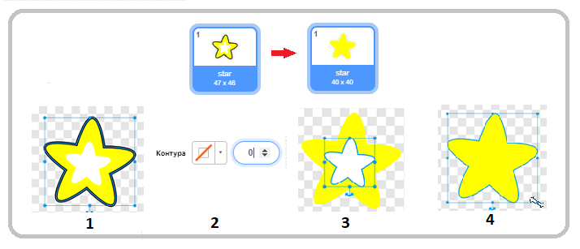
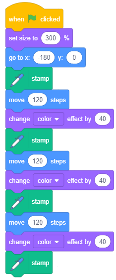
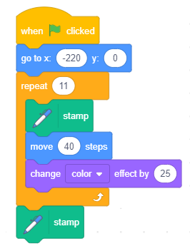
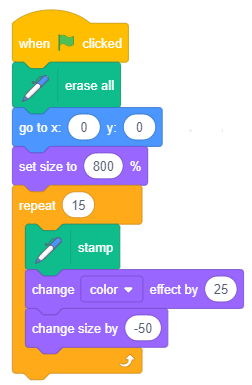
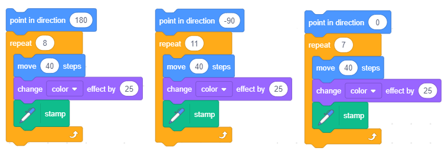
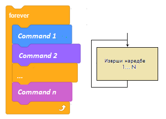
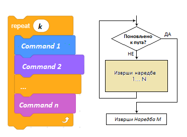
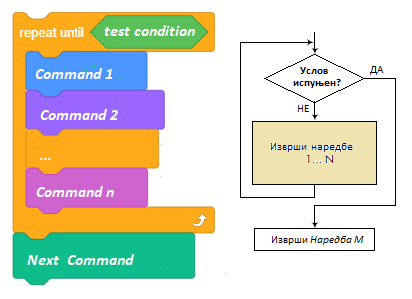

Понављање корака
================

.. include:: blokovi.txt

Видели смо да је позорница 480 тачака широка и 360 тачака висока и да се свакој од тачака позорнице може приступити помоћу њених координата. У наредним примерима прaвићемо слике остављањем печата ликова на задатим позицијама. Разуме се, можемо да нацртамо лик који нам одговара коришћењем графичког едитора – на пример црвени круг или плави квадрат, али пошто желимо да слике буду атрактивније, у нашим примерима ћемо користити лик *Star* – жуту звезду из библиотеке ликова. 

Да бисмо прецизније могли да подешавамо слике, мало ћемо изменити звезду која изворно има величину 47х48 пиксела, што можемо видети ако пређемо у картицу *Костими* (sl 5_1). Нама одговара да лик буде величине 40х40, јер тада у једном реду од левог до десног руба позорнице може да стане тачно 12 звезда (480:40), а између горњег и доњег руба екрана може да их стане тачно 9 (360:40). Даље, више нам одговара да лик нема контуру и да је цео равномерно попуњен једном бојом.

.. image:: ../_images/5/sl5_1.png
   :width: 700px   
   :align: center

.. infonote::

  Како мењамо лик *Star*

    1. Алатком Избор селектујемо цео лик

    2. Уклонимо контуру (поставимо њену дебљину на 0)

    3. Изаберемо унутрашњу звезду и обришемо је

    4. Изаберемо цео лик и доведемо га на величину 40х40.
    

Овако измењена звезда биће једини лик у наредним задацима.

|prouci| Задаци
---------------

.. |prouci| image:: ../_images/prouci.png

.. questionnote::

   1. Напиши програм који ће нацртати 4 звезде различитих боја величине 120 пиксела једну поред друге од левог до десног руба екрана као на следећој слици.

.. image:: ../_images/5/slika1.png
   :width: 495px   
   :align: center

До решења можемо доћи следећим корацима:

1.	повећамо димензије лика 300% тако да сада звезда има димензије 120х120, 
2.	пошаљемо лик тако да његов леви крај буде уз леви руб позорнице: х=-180
3.	оставимо печат
4.	померимо лик удесно за његову ширину (120 корака)
5.	променимо боју лика (наредбом за мењање ефекта боја)
6.	оставимо печат
7.	померимо лик удесно за његову ширину (120 корака)
8.	променимо боју лика (наредбом за мењање ефекта боја)
9.	оставимо печат
10.	померимо лик удесно за његову ширину (120 корака)
11.	променимо боју лика (наредбом за мењање ефекта боја)
12.	оставимо печат

Примећујемо да смо кораке 4-6 поновили 3 пута. Програм који одговара овом опису приказан је на следећој слици.

.. questionnote::

   2. Напиши програм који ће нацртати 12 звезда величине 40х40 једну поред друге од левог до десног руба екрана као на следећој слици.

.. image:: ../_images/5/slika2.png
   :width: 490px   
   :align: center

Овај задатак је сличан претходном, само нема потребе да повећавамо димензије лика. Прво бисмо га послали на место х=-220, у=0, па оставили печат. Затим би 11 пута требало поновити кораке 4-6 претходног програма, при чему бисмо лик померали 40 уместо 120 корака. Али колико времена би било потребно да направимо овај једноставан програм?

Свакако би било брже да после остављања првог печата кажемо да треба 11 пута поновити кораке 4-6. У Скречу имамо могућност да то учинимо наредбама понављања.

Блок који нам омогућава да само једном напишемо групу наредби која се понавља и задамо колико пута их треба поновити има следећи изглед. |ponovi10|

То је пример такозваних С-блокова, блокова који својим изгледом подсећају на слово С. Слот унутар С-блока је специјална врста улаза који прима скрипту као улаз. Овај блок  има 2 улаза: један за број понављања и један за скрипту. 

Решење задатка приказано је на следећој слици.

.. questionnote::

   3. Напиши програм који ће нацртати 15 звезда различитих боја једну преко друге у центру екрана при чему прва треба да буде величине 320х320 (800% изворне величине), а свака следећа за 50 мања као на следећој слици.

.. image:: ../_images/5/slika3.png
   :width: 700px   
   :align: center

Кад кажемо за 50 мања мислимо 750%, 700%, ... изворне величине (не 50 пиксела мања, нити 50% од 800%). Да се слика не би мешала са евентуалним остацима слике из претходних извршавања програма, на почетку ћемо ставити наредбу за брисање.

Решење задатка приказано је на следећој слици.

.. questionnote::

   4. Напиши програм који ће нацртати оквир око позорнице састављен од звезда различите боје као на следећој слици.

.. image:: ../_images/5/slika4.png
   :width: 490px   
   :align: center

Решавање овог задатка можемо остварити повезивањем решења 4 једноставнија проблема.

1. Цртање звездица на горњем рубу позорнице с лева на десно.
2. Цртање звездица на десном рубу позорнице од горе на доле.
3. Цртање звездица на доњем рубу позорнице с десна на лево.
4. Цртање звездица на левом рубу позорнице од доле на горе.

Први проблем смо већ решили у задатку 2. Потребно је само променити вредност за у почетне позиције звезде, уместо у=0 треба ставити у=160.
Други проблем најједноставније је решити ако се промени оријентација лика, уместо да се креће удесно треба да иде надоле. Блокове померања промене боје, и остављања печата треба поновити 8 пута.
Трећи и четврти проблем решавују се на сличан начин, само се претходно промени оријентација лика и израчуна колико пута треба да остави печат. Део решења приказан је на следећој слици.

Структура решења овог задатка у коме  се ниже петља за петљом назива се **линијска композиција циклуса**.

.. questionnote::

   5. Напиши програм који ће нацртати 4 звезде величине 120 пиксела једну поред друге од левог до десног руба екрана Свака од ове 4 звезде треба да буде формирана од више звезда различите величине и боје попут звезде из задатка 3.

Очекујемо да резултат извршавања буде као на следећој слици.

.. image:: ../_images/5/slika5.png
   :width: 490px   
   :align: center

Решење овог задатка такође има сложену структуру, али у њему је потребно угњездити петљу која печатира мање звезде преко већих као у задатку 3, у петљу која се извршава 4 пута и црта велике звезде једну поред друге као у задатку 1. Комплетно решење приказано је на следећој слици.

.. image:: ../_images/5/zvezda5.png
   :width: 300px   
   :align: center

Структура решења овог задатка у коме  се улаже петља у петљу назива се **концентрична композиција циклуса**.

|pitaj| Одговори на следећа питања
----------------------------------

.. |pitaj| image:: ../_images/pitaj.png

Питање 1
~~~~~~~~

.. mchoice:: for01
   :multiple_answers:
   :answer_a: 
   :answer_b: 
   :answer_c: 
   :answer_d: 
   :correct: a, b, d
   :feedback_a: Лик прави 10 * 8 = 80 корака.
   :feedback_b: Лик прави 10 * (5 + 3) = 80 корака.
   :feedback_c: Лик прави  2 * 10 + 5 * 10 = 70 корака.
   :feedback_d: Лик прави 5 * 10 + 10 + 2 * 10 = 80 корака.
  
   Којим од бројачких циклуса се постиже да лик направи 80 корака? (Изабери све тачне одговоре).

   .. image:: ../_images/5/for01.png
      :width: 700px   
      :align: center

Питање 2
~~~~~~~~

.. mchoice:: for02
   :multiple_answers:
   :answer_a: 
   :answer_b: 
   :answer_c: 
   :answer_d: 
   :correct: b, c, d
   :feedback_a: Лик прави 5 * 8 = 40 корака.
   :feedback_b: Лик прави 8 * 10 корака.
   :feedback_c: Лик прави 10 * (5 + 3) корака.
   :feedback_d: Лик прави 5 * 2 * 8 корака.
   
   Којим од бројачких циклуса се постиже да лик направи 80 корака? (Изабери све тачне одговоре).

   .. image:: ../_images/5/for02.png
      :width: 700px   
      :align: center

|pokusaj| Покушај
-----------------

.. |pokusaj| image:: ../_images/pokusaj.png

Вежба 1
~~~~~~~

.. infonote::

  **Отворена огрлица**. Креирај пројекат који приказује низ кругова различите боје и величине почев од левог краја позорнице. 
  
  .. image:: ../_images/5/boja1.png
      :width: 240px   
      :align: center

  .. reveal:: упутство2
     :showtitle: Прикажи упутство
     :hidetitle: Сакриј упутство
 
     **Упутство:**
   
     Слика се добија спуштањем оловке различитих боја, дебљине 80, коју држи сакривен лик који се на почетку налази на позицији (-200,0). 
     У циклусу који се понавља 5 пута лик треба да иде 80 корака са подигнутом оловком, повећава број боје оловке за 30, па је спусти. 
     Почетна вредност за боју је 0. Обезбеди да се кликом на зелену заставицу обрише претходни цртеж.     
  

Вежба 2
~~~~~~~

.. infonote::

  **Затворена огрлица**. Креирај пројекат који црта затворен низ од 12 кругова различите боје дебљине 50.
   
  .. image:: ../_images/5/boja2.png
      :width: 200px   
      :align: center
      
  .. reveal:: упутство3
     :showtitle: Прикажи упутство
     :hidetitle: Сакриј упутство
 
     **Упутство:**
   
     Слика се добија спуштањем оловке различитих боја, дебљине 50, коју држи сакривен лик који се на почетку налази на позицији (-50,50). 
     У циклусу који се понавља 12 пута лик треба да иде 50 корака са подигнутом оловком, окрене се за 30 степени и повећава број боје оловке за 15, 
     којом затим остави траг. Почетна вредност за боју је 0. Обезбеди да се кликом на зелену заставицу обрише претходни цртеж.

Вежба 3
~~~~~~~

.. infonote::

  **Низ кругова**. Креирај пројекат који приказује низ кругова различите боје и величине почев од левог краја позорнице.
    
  .. image:: ../_images/5/krugovi1.png
      :width: 240px   
      :align: center
      
  .. reveal:: упутство4
     :showtitle: Прикажи упутство
     :hidetitle: Сакриј упутство
 
     **Упутство:**
  
     Слика се добија спуштањем оловке различитих дебљина и различитих боја коју држи сакривен лик који се на почетку налази на позицији (-200,0).
     Почетне вредности за боју су 0, а за дебљину 80. У циклусу који се понавља 5 пута треба повећавати број боје оловке за 30 и смањивати њену дебљину за 10.
     Лик треба да иде по 80 корака удесно, разуме се са подигнутом оловком. У петљи треба да се налази и наредба *чекај* да боље испратиш шта се дешава.
     Обезбеди да се кликом на зелену заставицу обрише претходни цртеж.

  
Вежба 4
~~~~~~~

.. infonote::

  **Концентрични кругови**. Креирај пројекат који приказује низ концентричних кругова различите боје у центру позорнице.
    
  .. image:: ../_images/5/krugovi2.png
      :width: 200px   
      :align: center
      
  .. reveal:: упутство5
     :showtitle: Прикажи упутство
     :hidetitle: Сакриј упутство
 
     **Упутство:**
     
     Слика се добија спуштањем оловке различитих дебљина и различитих боја коју држи сакривен лик који се налази у центру екрана. 
     У циклусу који се понавља 8 пута треба повећавати број боје оловке за 25 и смањивати њену дебљину за 30. Почетне вредности за боју су 0 (црвена), а за дебљину 240 (најдебља).
     У петљи треба да се налази и наредба *чекај* да боље испратиш шта се дешава. После сваке промене вредности атрибута оловке треба је спустити.
     Обезбеди да се кликом на зелену заставицу обрише претходни цртеж.

 
|bug| Исправи грешке
--------------------

.. |bug| image:: ../_images/bug.png

Грешка 1
~~~~~~~~

:Питање:
   Ученик је желео да се његов лик корача између леве и десне ивице позорнице. 
   Зато је у бесконачан циклус унео стално мењање костима и корачање по 10 корака док не дође до руба, када се окреће.
   Међутим, није му се свидело што лик ка левој ивици позорнице корача наглавачке. Шта треба да уради да поправи ову грешку?
   
.. image:: ../_images/5/greska5_1.png
   :width: 210px   
   :align: center   
   
.. reveal:: сакривање10
   :showtitle: Прикажи одговор
   :hidetitle: Сакриј одговор
 
   **Одговор:**
   
   То може да поправити укључивањем наредбе |nacin_okretanja| у скрипту лика.

Грешка 2
~~~~~~~~

:Питање:
   Ученик је желео да његов лик лептир, који има два костима - са подигнутим и спуштеним крилима, стално клизи машући крилима  између тачака чије се координате бирају на случајан начин.
   Али његов програм то није омогућио. Лептир је од једне до друге тачке клизио или са спуштеним или са подигнутим крилима. У чему је грешка?
   
.. image:: ../_images/5/greska5_4.png
   :width: 625px   
   :align: center
   
     
.. reveal:: сакривање8
   :showtitle: Прикажи одговор
   :hidetitle: Сакриј одговор
 
   **Одговор:**
     
   Требало је направити две скрипте које се извршавају паралелно.

   .. image:: ../_images/5/resenje5_4.png
      :width: 625px   
      :align: center   

|knjiga| Шта смо научили
------------------------

.. |knjiga| image:: ../_images/knjiga.png

Кроз претходне примере и вежбе упознали смо наредбе понављања. Најједноставнији пример наредби понављања је наредба за опис тзв. "бесконачног циклуса". Наредбе које се понављају чине **тело циклуса**. Њихово извршавање може се зауставити само прекидањем програма. 

На пример, ако желимо да постигнемо илузију да мачак хода, балерина игра или лептир лети, довољно је да им придружимо скрипту у којој се у бесконачном циклусу понављају наредбе |sledeci_kostim| и |cekaj|.  

Разуме се, лик треба да има бар два костима и чекање треба да буде кратко, на пример 2 десета дела секунде (0.2). Наредба чекања између приказа различитих костима лика неопходна је да бисмо приметили промене у изгледу.
Наиме, људско око није у стању да региструје тако брзе промене као оне које компјутер обавља. Зато наредбама чекања "кочимо" приказ следећег изгледа, док наше око не прихвати претходну слику.

У примерима цртања користили смо тзв. "бројачке циклусе". То су понављања код којих се унапред зна колико пута ће се извршити тело циклуса. 

У Скречу постоји наредба за опис циклуса чији број понављања није унапред познат, већ зависи од тога да ли је испуњен услов за излазак из циклуса. 

Услов да ли ће се прескочити наредбе тела циклуса (услов за излазак) проверава се на почетку циклуса, па се може десити да се циклус не изврши ни  ако је тај услов испуњен при првој провери. 
Такође се може десити да се циклус извршава бесконачно ако се услов за излазак из циклуса никада не испуни.

|project| Креирај пројекат Гладна ајкула
----------------------------------------

.. |project| image:: ../_images/project.png

Направи пројекат у коме ће главни лик - Ајкула  ловити рибе. Све ликове (ајкулу и 3 рибе) и позадину учитај из библиотека ликова и позадина.
Ајкула (Shark) има три костима, па њена реакција када је притиском на дирку размак пошаљеш да поједе плен, може да буде ефектнија од реакције вештице 
(која је само вриштала када би се устремила на духа). Нека се у пројекту бесконачно понавља крстарење ајкуле лево десно, а рибе које су поједене нека се поново појављују после 3-5  секунди.
Различито трајање паузе између два појављивања риба и различито место на коме ће се појављивати обезбеди коришћењем операције *случајан број*.
