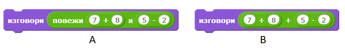

Strings
=========

.. include:: blocks.txt

.. include:: icons.txt

.. infonote::

 |intro10s|

In this lesson, we will show how string variables can be used to solve different types of tasks. At the same time, we will learn how Scratch store stings and functions of blocks used to operate strings.

A string represents a series of characters that are treated a single piece of data. Strings have a wide application in programming. We can create programs that combine, compare, sort, encode, and otherwise process text. You should bear in mind that numbers can also be treated as strings, but in that case, we are not dealing with values they represent, but with characters - digits they consist of.  

.. topic:: Operations performed on strings

 To better understand these operations, we will show the result of each operation performed on strings s1=BANANA and s2=ANA. 
  
 In programming languages, the operations most frequently performed on strings are the following:

 - determining the length of the string
      ``length of s1`` → 6

 - comparing strings 
      determining which comes first alphabetically

      ``s1<s2 ?`` → false 

      this is false because "BANANA" comes after "ANA" in alphabetical order,

 - connecting (joining) strings 
      ``join s1 and s2`` →BАNАNААNА,

 - selecting a character occupying a specific position in the text
      ``letter 3 of s1`` → N,

 - contains?
      checks if string s1 contains the string s2

      ``s2 in s1 ?`` → true 

      this is true because "BANANA" contains "ANA",

 - position 
      determining the first position in the string, which contains the second string

      pos(s1,s2): ``position s2 in s1`` → 2,

 - copying 
      creating a new string out of a given number of characters d starting from a given position p in the initial string

      copy(s,p,d): ``copy from s1 characters 4 starting from 3`` → NАNА,

 - deleting 
      modifying string s1 by deleting a given number of characters d starting from the given position p in the initial string

      delete(s1,p,d): ``delete from s1 characters 3 starting from 4`` → BАNА,

 - inserting 
      modifying string s1 by inserting string s2 into the string s1 starting from the given position p

      insert(s1,s2,p): ``insert s2 into s1 starting from 3`` → BААNАNАNА.

 The last four are not built-in operations in Scratch. However, in the example "String Operations" we will show how we can implement them ourselves. 

  
|study| Study the following examples
----------------------------------------

Example 1 - Project "Parrot"
~~~~~~~~~~~~~~~~~~~~~~~~~~~~

.. level:: 1

The main sprite in this project is a parrot. First, the parrot asks the user his/her name and then waits for the user to type his/her name and press *Enter* or click on the check sign located in the right corner of the answer field. Then the parrot greets the user by his/her name and says what the first letter of name is and how many letters there are in the name. The conversation between the sprite and the user is presented in the figure below.   

.. image:: ../_images/10/fig10_1.png
   :width: 430px   
   :align: center

To create this project, we used operations, which select the first letter from the name and determine how many letters are in the name.

After executing the command |ask_wait|, Scratch stores the series of characters entered by a user into the space called |answer|.

The following figure shows how the answer is stored, which operations are used to extract the information broadcast by the sprite as output data with the command ``say``.

.. image:: ../_images/10/fig10_2.png
   :width: 600px   
   :align: center

The third operation, which was used to compose the output message, is |join|.

The script of the *Parrot* project is presented in the figure below. 

.. image:: ../_images/10/fig10_3.png
   :width: 475px   
   :align: center

The project that follows will show you how you can use string operations to extract specific digits, which form numbers. 

.......

Example 2 - Project "Exchange Digits"
~~~~~~~~~~~~~~~~~~~~~~~~~~~~~~~~~~~~~

.. level:: 2

**Project Scenario**

The main part of this project is a script, which exchanges the first digit and the third digit in a three-digit natural number *x* entered through the input. 

The presenter, who is the main sprite in this project, asks the user to enter a three-digit number. The program checks whether a three-digit number has been entered. If not, the request will be repeated until a three-digit number is entered. Then, the first and the third digit are extracted, and the new  
*reversed* number is formed where the first and the third digit have been exchanged. This new number is created by using two operations |join|. 
In the end, the presenter broadcasts the original and the newly formed number.

The project's script is presented in the following figure.

.. image:: ../_images/10/fig10_4.png
   :width: 645px   
   :align: center

.......

The following project checks whether the entered word is a palindrome. A *palindrome* is a word or a phrase, which reads the same from left to right and from right to left. For example, the word "madam" is a palindrome. A number that is a palindrome is similarly defined. For example, 12321 is a palindrome. 

Example 3 - Project "Palindrome"
~~~~~~~~~~~~~~~~~~~~~~~~~~~~~~~~

.. level:: 3

The presenter asks the user to enter a word. The variable *d* receives the length of the word as the value. The program compares the first with the last letter, the second with the penultimate, and so on until the middle of the word. The variable *i*, whose initial value is 0 and which increases by 1 within the loop, enables these comparisons to be performed with the following check.    

.. image:: ../_images/10/fig10_5.png
   :width: 485px   
   :align: center

The variable *p* indicates the number of checks. If one of the checks determines that the letters, which are being compared are not the same, the word is not a palindrome, and this will be registered by assigning 0 to the variable *pal* (which is set at 1 at the beginning).
After the program is done checking all the pairs of letters, it will write a message saying whether the word is a palindrome or not (*pal* = 1 yes, otherwise no). 

The script for the project *Palindrome* is presented in the following figure.

.. image:: ../_images/10/fig10_6.png
   :width: 495px   
   :align: center

.......

Example 4 - Project "String Operations"
~~~~~~~~~~~~~~~~~~~~~~~~~~~~~~~~~~~~~~~

In this project, the user is asked to select one of the operations: *copy* or *delete*. Input is requested depending on what was selected, and then the result of the operation is written. The operation is set by clicking on the appropriate button, which then broadcasts the operation. When the message identifying the selected operation is received, the script that executes the given operation will run.
There are two sprites participating in the project: the button *Copy* for making copies and *Delete* for deleting. The script that performs deletion is somewhat simpler. Based on the values entered for the number of characters and the positions from which they are taken, a new string s2 is established. This string is empty in the beginning, and it is established by adding one character at a time from a given part of the initial string.
 
.. image:: ../_images/10/fig10_7.png
   :width: 330px   
   :align: center
   
The scripts added to the receipt of the message *Copy* are presented in the following figure. Data entry and the formation of the output message are presented as separate procedures. These procedures can also be used when the *Delete* option is requested. 
 
.. image:: ../_images/10/fig10_8.png
   :width: 680px   
   :align: center
   
The script for deleting does the opposite - it forms the string from the parts located in front of and behind the marked characters. It also starts with an empty string. First, it records characters from the part in front, which are followed by characters from the part behind.     
 

|ask| Answer the following questions 
-------------------------------------

Question 1
~~~~~~~~~~~

.. level:: 1

.. mchoice:: string1
   :answer_a: yes
   :answer_b: no
   :correct: a
   :feedback_a: Correct. 
   :feedback_b: 
   
    Can a string contain signs for arithmetic operations?

Question 2
~~~~~~~~~~~

.. level:: 1

.. mchoice:: string2
   :answer_a: L
   :answer_b: Е
   :answer_c: N
   :answer_d: А
   :correct: b
   :feedback_a: This is letter 1.
   :feedback_b: Correct.
   :feedback_c: This is letter 3.
   :feedback_d: This is letter 4.
   
   What will be the result of the operation ``letter 2 of LENA``?

Question 3
~~~~~~~~~~~

.. level:: 1

.. mchoice:: string3
   :answer_a: yes 
   :answer_b: no 
   :correct: b
   :feedback_a:  
   :feedback_b: Correct.
   
     Will the string say the same thing during the running of the commands A and B?

   
Question 4
~~~~~~~~~~~

.. level:: 1

.. mchoice:: string4
   :answer_a: L
   :answer_b: LENA
   :answer_c: 4
   :answer_d: Length of LENA
   :correct: c
   :feedback_a: This would be achieved with the operation letter of.
   :feedback_b: 
   :feedback_c: Correct.
   :feedback_d: This would be achieved by joining these two words.
   
    What will be the result of the operation ``length of LENA``?

Question 5
~~~~~~~~~~~

.. level:: 1

.. mchoice:: string5
   :answer_a: BАNА
   :answer_b: BАNАNА
   :answer_c: NАBАNА
   :answer_d: NАNАBА
   :correct: b
   :feedback_a: 
   :feedback_b: Correct.
   :feedback_c: 
   :feedback_d: 
   
   What will be the result of the operation ``join BA and NANA``? 

Question 6
~~~~~~~~~~~

.. image:: ../_images/10/q10_6.png
   :width: 680px   
   :align: center

.. dragndrop:: string6
    :feedback: Try again
    :match_1: A|||A
    :match_2: B|||nothing returns
    :match_3: C|||1
    :match_4: D|||7
       
    By dragging, connect the commands with the return values.      
   

|try| Try it!
--------------

Exercise 1 
~~~~~~~~~~~
.. level:: 2

.. infonote::

  Create a program, which will form a number from the same digits as in the natural number **n**, but arranged it the reverse order.

.......      

Exercise 2
~~~~~~~~~~~
.. level:: 2

.. infonote::

  Write a program that determines the sum of the digits and the number of digits for the natural number **n** (1<= n <1000). For example:
 
  - n =12 the sum of the digits 3, and the number of digits is 2; 

  - n =102 the sum of the digits 3, and the number of digits is 3.   

.......

Exercise 3
~~~~~~~~~~~

.. level:: 3

.. infonote::

  Write a program that will make a list of all three-digit Armstrong numbers. A number is considered to be an Armstrong number if it is equal to the sum of the cubes of its digits.

    
|book| Summary
----------------------

 In this lesson, we introduced the data type called string and the most common operations performed on this type of data. Through the project examples, we showed how the string variables can be used for solving different types of problems, and how to work with string operations that are built into Scratch.

**Project Examples**: 10Studio_

.. _10Studio: https://scratch.mit.edu/studios/25119486/

**New concepts**: string, palindrome.

**New commands**: |operator_blocks| - |text_contains|, |letter|, |length_text|.

|project| Create a project
-------------------------------------------

Project 1 - "Encoding"
~~~~~~~~~~~~~~~~~~~~~~~~~

.. level:: 3

Create a project, which encodes and decodes the input text in the following manner. 

The list "original" stores 26 letters of the alphabet in the regular order. The list "code" stores 26 letters in any order that is different from the one in the list "original". To make the decoding process harder, if there is a vowel in some position in one of the lists, there should also be a vowel in the same position in the other list. 
The user enters the text, which the project should encode and decode depending on whether the user clicked on the button "encode" or "decode".

For example, if the letters in the lists "original" and "code" are in the following orders:

= = = = = = = = = = = = = = = = = = = = = = = = = = 

A B C D E F G H I J K L M N O P Q R S T U V W X Y Z

V U B G D Q X Y Z E Ј K L O М N А W P R S Т F H C I

= = = = = = = = = = = = = = = = = = = = = = = = = = 

and the user enters the text MASK, the program will encode it as LVPJ. 

However, if the input text MASK should be decoded, the program will turn it into ОQUL.

Project 2 - "Backward"
~~~~~~~~~~~~~~~~~~~~~~

.. level:: 3

Create a project where the user is asked to enter how many words he or she wants to transform (n), and then enters a name into the loop that will be repeated n number of times, the name is entered into the list "names", and then transformed into the string obtained when the name is read from right to left, after which it will be entered into the list "backward".    

For example, if the user entered n=3 and then names: LENA, MARIO, KATARINA; the list "backward" should contain:
ANEL, OIRAM and ANIRATAK.

Project 3 - "Numbers"
~~~~~~~~~~~~~~~~~~~~~~

.. level:: 3

Create a project, which makes a list of all three-digit numbers, which can be divided by the number obtained when the middle digit is taken out.

